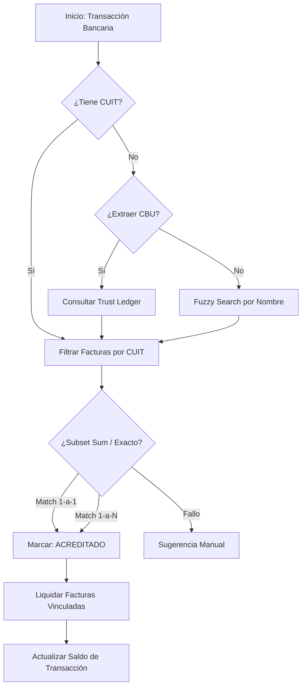

# 📖 Especificación Técnica: Motor de Conciliación BiFlow v3.1

Este documento detalla la lógica, "circuitos" y reglas de negocio del motor de conciliación. Sirve como referencia para auditorías o migraciones (ej: de TypeScript a PostgreSQL RPC).

---

## 🚦 El Funnel de Conciliación (Estrategia de Embudos)
El motor aplica un proceso de "reducción" para encontrar el mejor match posible, descendiendo por niveles de confianza. Si un nivel falla, se pasa al siguiente.

### Niveles de Confianza (Match Level)
| Nivel | Método | Confianza | Descripción |
| :--- | :--- | :--- | :--- |
| **L1** | **CUIT Exacto** | 🔵 Máxima | El CUIT en el extracto bancario coincide con el CUIT de la entidad en BiFlow. |
| **L2** | **CBU / Trust Ledger** | 🟢 Muy Alta | Se extrae el CBU del texto bancario y se busca el CUIT asociado en la tabla de "parejas históricas". |
| **L3** | **Fuzzy Search (Nombre)** | 🟡 Alta | Se fragmenta la Razón Social de las facturas pendientes y se busca si alguna palabra clave está en la descripción del banco. |
| **L4** | **Cercanía & Monto** | 🟠 Media/Baja | Matching por monto exacto (+/- $1.5) y fecha cercana (+/- 3 días) para transacciones sin referencias textuales. |

---

## ⚙️ Lógica de Procesamiento (Circuitos)

### Fase 0: Sincronización de Estados (Orphans)
Antes de empezar, el motor detecta transacciones "huérfanas": aquellas que ya tienen un `movimiento_id` enlazado pero cuyo estado sigue siendo `pendiente`. 
- **Lógica:** Si el `monto_usado` es igual o mayor al monto total (con 0.05 de tolerancia), se marca como `conciliado`.

### Fase 1: Conciliación Administrativa
Busca cerrar el círculo entre una Factura y su Recibo/OP (movimientos en la tesorería de BiFlow).
- **Match por Referencia:** Busca el número de factura (`nro_factura` o los últimos 4-5 dígitos) dentro de los campos `concepto` u `observaciones` del movimiento de pago.
- **Match por Monto:** Si el monto y la entidad coinciden exactamente, y el movimiento no tiene aplicaciones previas, se genera la vinculación automática.

### Fase 2: Conciliación Bancaria Automática
Busca enlazar Transacciones Bancarias contra Instrumentos de Pago (Cheques, Transferencias, Depósitos) ya cargados.

---

## 📏 Parámetros de Precisión (Tolerancias)
Para evitar que diferencias de céntimos rompan el flujo de caja, el motor aplica márgenes de error:
- **Tolerancia de Monto:** `$2.0` (Dos pesos). Cualquier diferencia menor a este monto se asume como redondeo o comisión mínima no declarada.
- **Ventana de Tiempo:** `3 días`. Para el Nivel 4 (Proximidad), se ignoran facturas con vencimientos alejados más de 3 días de la fecha bancaria.
- **Subset Sum Limit:** `15 elementos`. El algoritmo de búsqueda de combinaciones se limita a un máximo de 15 facturas para evitar bloqueos del procesador.

---

## 🚨 Manejo de Anomalías
El motor "etiqueta" transacciones sospechosas sin detener el flujo:
- **`alerta_precio`**: Transacciones unitarias mayores a `$5,000,000`.
- **`riesgo_bec`**: CBU detectado que no tiene un CUIT asociado conocido en el Trust Ledger.

---

## 📁 Ubicación de Respaldos de Código
Si necesitas verificar el código original que implementa esta lógica en JavaScript, puedes consultar la carpeta:
`d:\proyecto-biflow\lib\_legacy_engines\`

- **Archivo Principal:** `reconciliation-engine.ts` (Lógica de Funnel y Subset Sum).
- **Cálculos:** `treasury-engine.ts` (Proyecciones de caja e IVA).
- **Anomalías:** `anomaly-engine.ts` (Detección de patrones).
